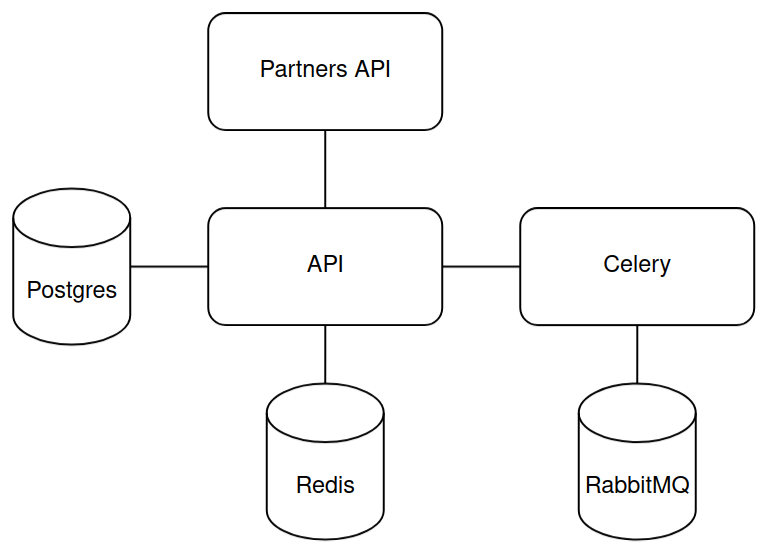
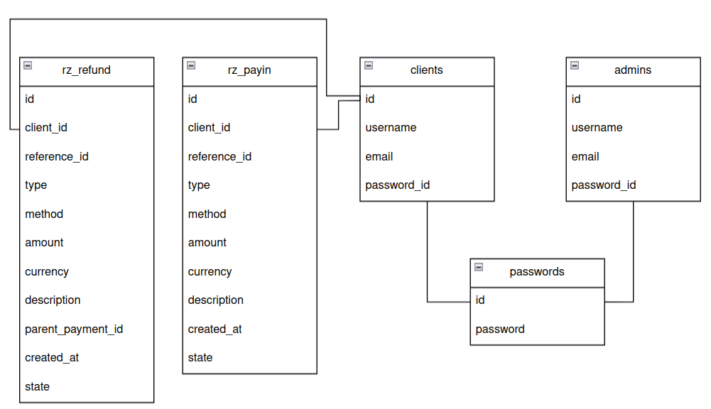

# AmPayProject

Project represents a RESTful API integrated with partners API. This API can track and display payment information.

---

### Content List

- [Dowlanding](##Dowlanding)
- [Description](##Description)
- [Explotation](##Explotation)

---

## Dowlanding

To begin with you have to install source code using link in GitHub.

```bash

git clone https://github.com/qwissx/AmPayProject

```

## Description

Using stack: Redis, FastAPI, RabbitMQ, Celery, Aiohttp.

Architecture of the project:



Tables in PostgreSQL:



## Explotation

To start this first of all you have to fill completely env file in api service. After that you have to start your docker daemon and run this command: 

```bash

sudo docker compose up

```

After this your API will be running on http://localhost:8000